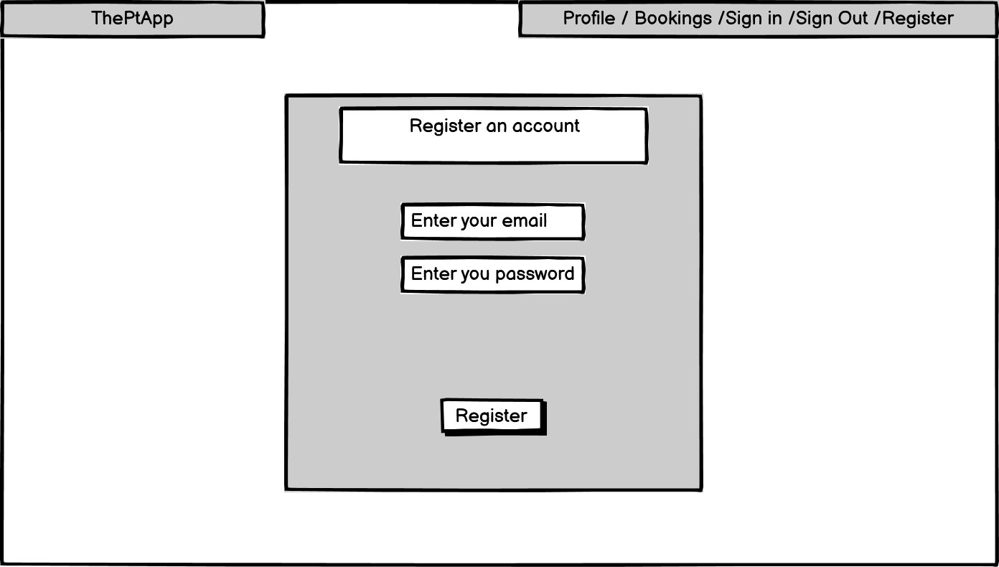
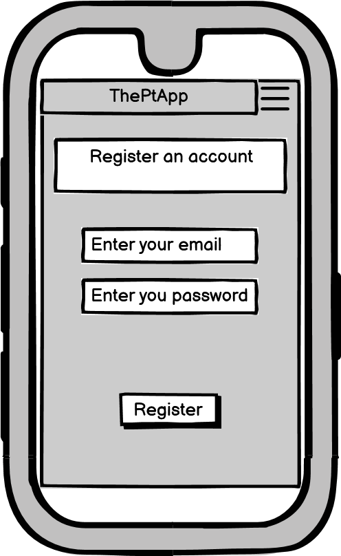
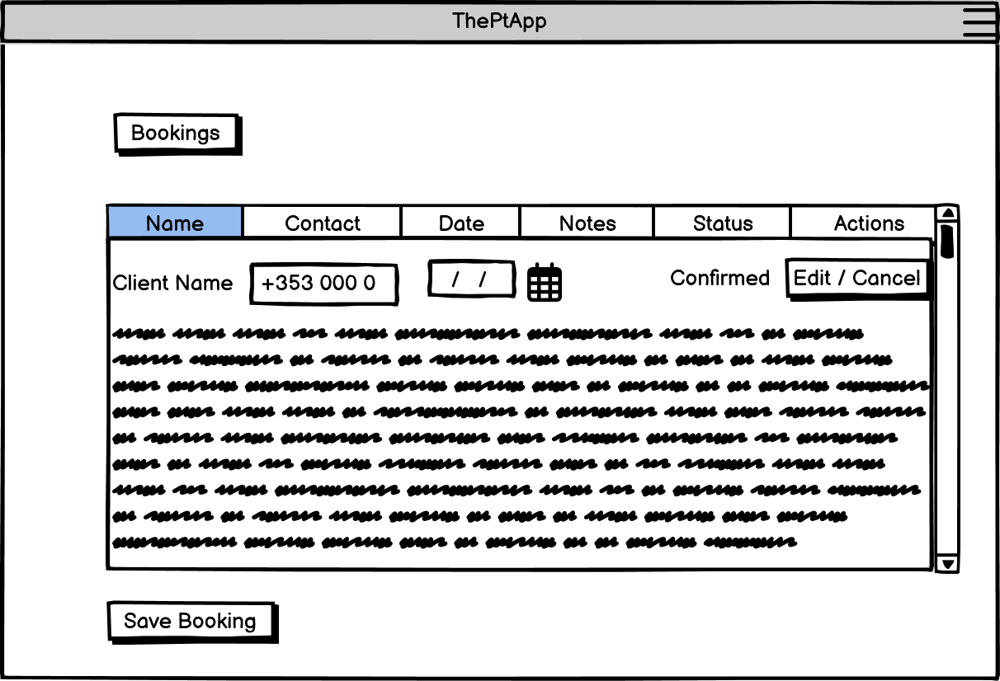
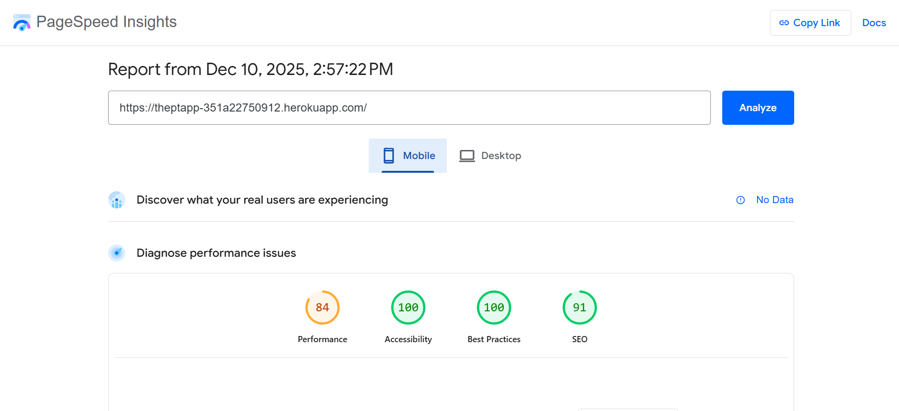
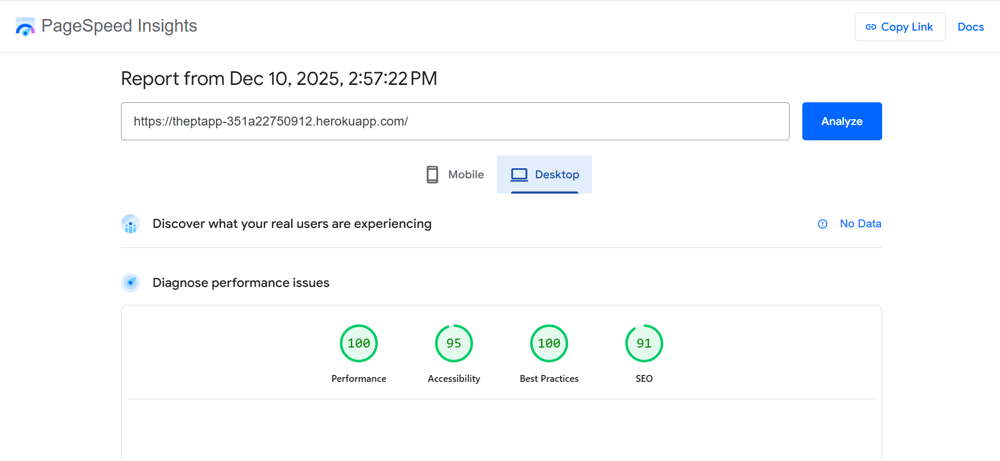
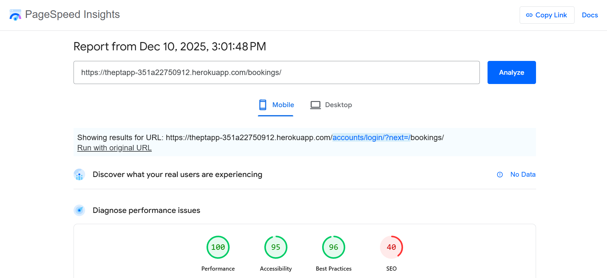
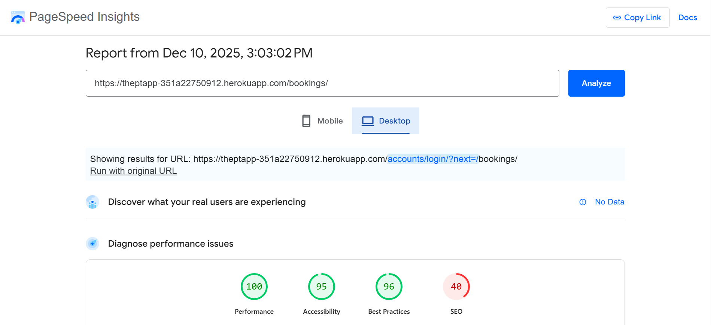
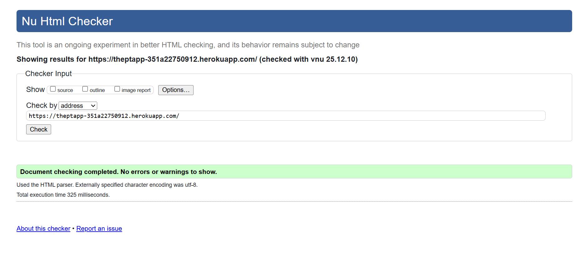
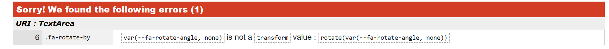

# theptapp

**Live URL**: https://theptapp-351a22750912.herokuapp.com/ 

## Purpose
Personal trainer booking system with role-based access (Client / Trainer).

## Table of Contents
- [User Stories](#user-stories)
- [UX Design](#ux-design)
- [Features](#features)
- [Testing and Validation](#testing-and-validation)
- [AI Usage](#ai-usage)
- [Future Enhancements](#future-enhancements)
- [Deployment and Hosting](#deployment-and-hosting)
- [Credits](#credits)

## User Stories

### Agile Workflow Approach

This project follows an **Agile methodology** with user stories representing key features of the application. Features were prioritized using the **MoSCoW system**:

1. **Must Have** - Critical features required for the app to function
2. **Should Have** - Important features that add significant value
3. **Could Have** - Nice-to-have features for future enhancement

User stories were developed based on personal experience with booking software and with AI assistance. The **GitHub Projects board** was used to manage and track progress throughout the development lifecycle, with "Must Have" features moved to the completed section first, followed by other priorities.

**📋 View the Project Board:** [GitHub Projects](https://github.com/users/Brianon97/projects/9)

### Must Have:
- As a user, I want to register a form in order to create an account.
- As a user, I want to access the login form so I can manage my bookings.
- As a user, I want to edit, cancel and manage the status of my bookings.
- As a user, I want to be notified when I make or cancel a booking.
- As a user, I want to be able to take notes and view the date of the booking.

### Should Have:
- As a client, I should have options of packages to choose from.
- As a user, I should have a separate page for the trainer and client.
- As a client, I should be able to cancel and reschedule bookings that notify the trainer.
- As a user I should be able to leave testimonial reviews.
- As a user I should be able to make payments through strip integration.

### Could Have:
- As a user, have motivational tips to leave in the client page.
- As a user I could have a section for diet plans that allows you to view and choose food preferences and current plans.
- As a user I want input workouts to track my progress in strength, weight or other goals.
- As a user, I want to view workout plans and be able to save/bookmark my favorite.
- As a user, I want to change the background theme so that I can personalize the app.
- As a user, I want to share completed workouts on social media.

## UX Design

### Wireframe

- **Sign up desktop:**

- **Sign up mobile:**

- **Booking Form:**

### ERD

- - The core of the app is built around Django's built-in `User` model.
- A user with `is_staff = True` is a **Trainer**; `is_staff = False` is a **Client**.
- The `Booking` model links trainers and clients via foreign keys.
- `client_name` and `client_contact` are fallback fields (in case a client account is deleted).
- One trainer can have many bookings; one client can have many bookings.
- No separate profile tables are used — keeping the app simple, fast, and maintainable.

### Colors and fonts

This project uses clear and modern text styling to ensure readability and health themed colors :

- ** Primary Brand Colors:**

- Cyan/Turquoise: #00d4ff (signup button, footer links)
- Cyan Hover: #00b0d4 (signup button hover)
- Navy Blue Gradient: #1e3c72 to #2a5298 (navbar)
- Dark Footer: #111 (footer background)

- **Font Family:** Uses **Segoe UI**, with **sans-serif** as a fallback for a clean, modern look.
- **Font Size:** The base font size is **16px**, set through a CSS variable (`var(--bs-body-font-size)`) for responsive flexibility.
- **Text Color:** The text color is **white** (`rgb(255, 255, 255)`), applied using Bootstrap-style variables to maintain consistent color and opacity.
- **New Booking Button Color:**
The button is green - btn-success in Bootstrap gives it a green background color to stand out for the user to see clearly.
- **Save Booking Button Color:**
- The button is blue - btn-primary in Bootstrap gives it a blue background color to match the theme of the site.
- **Cancel Booking Button Color:**
- The cancel button is red - bg-danger in Bootstrap gives it a red background color, with white text for users to easily identify .

### 🎯 DESIGN SYSTEM SUMMARY
- Framework: Bootstrap 5.3.3
- Icon Library: Font Awesome 6.5.0
- Main Font: Segoe UI (system font)
- Theme: Modern, clean design with blue/cyan accent colors and navy gradient navbar

## Features
- User have the ability to create accounts as clients or trainers.
- User Authentication verifies the user and displays appropriated layouts.
- Clients: View and cancel sessions,
- Trainer: Create, edit and cancel sessions.
- Responsive UI across devices 
- Form validation
- Secure login
- Notifications on sign up, login, logout, booking creation, edit & cancel.

## Testing and Validation

Lighthouse performance and accessibility checks were run on home and booking pages for both mobile and desktop profiles. Results snapshots are below:

- **Home (Mobile)** 
- **Home (Desktop)** 
- **Booking (Mobile)** 
- **Booking (Desktop)** 

### Summary 
- The home page for both mobile and desktop is technically fast and well-structured, earning perfect or near-perfect scores except SEO.
- SEO score of 40 indicates major search-indexing issues: The redirect to login (/accounts/login/?next=/bookings/) is likely blocking crawlers. Pages behind authentication don’t get indexed, leading to low SEO.

## Manual Testing

- Authentication: Registration, login, logout with trainer/client conditions
- CRUD Operations: Create, read, update, and delete work without errors
- Responsive Design: Proper layout adaptation across mobile, tablet, and desktop
- Browser Compatibility: Verified on Chrome, Firefox, Safari, and Edge
- Interactive Features: New booking, save booking, edit, and cancel buttons work without errors
- Data Validation: Form validation and error handling across mandatory input fields

### HTML Validation

HTML validation was performed using the [W3C Markup Validation Service](https://validator.w3.org/) and showed **0 errors** for the theptapp.

### CSS Validation
- https://jigsaw.w3.org/css-validator/

- 1 Error. 
- 
- It's a CSS validation warning from Font Awesome's minified stylesheet
- This is a known issue with Font Awesome's CSS.
- The validator complains because none isn't a valid transform value in the CSS spec. However, Font Awesome's JavaScript handles this at runtime by setting the actual --fa-rotate-angle CSS variable to a real value like 45deg.
- All modern browsers (Chrome, Firefox, Safari, Edge) support and render it correctly
- No, you can't fix it—it's in the external Font Awesome library
- Changing it would break the library's functionality
This warning is cosmetic and doesn't impact user experience

## AI Usage 
- Generated `Booking` model with proper fields
- Suggested admin list display and filters
- Helped write form validation logic
- Created unit test skeleton

## Future Enhancements
- Add functionality that allows clients to book available slots from a drop down menu which notifies the trainer.
- Include notifications for any canceled bookings between trainer or client.
- Develop a section for input putting and receiving workout and diet plans.
- Introduce a message section for two way communication during business hours.

## Deployment and Hosting

**Live Application:** https://theptapp-351a22750912.herokuapp.com/

The PT App is deployed on the Heroku Cloud Platform for reliable hosting and scalability. Production uses PostgreSQL via Heroku Postgres for robust data management, and WhiteNoise middleware serves static files efficiently to keep CSS, JavaScript, and images fast.

**Heroku Deployment Process**
- Prereqs: Heroku account + Heroku CLI, committed Git repo, complete `requirements.txt`, and a `Procfile` for process management.
- Create app: `heroku create theptapp`
- Add Postgres: `heroku addons:create heroku-postgresql:hobby-dev`
- Env vars: `heroku config:set SECRET_KEY=your-secret-key-here` and `heroku config:set DEBUG=False`
- Deploy: `git push heroku main`
- Migrate DB: `heroku run python manage.py migrate`
- Create admin: `heroku run python manage.py createsuperuser`
- Collect static: `heroku run python manage.py collectstatic --noinput`

**Local Development Setup**
- Clone: `git clone https://github.com/Brianon97/theptapp.git` then `cd theptapp`
- Virtualenv: `python -m venv venv` and activate (`source venv/bin/activate` or `venv\Scripts\activate`)
- Install deps: `pip install -r requirements.txt`
- Local env: add `SECRET_KEY` and `DEBUG=True` to `env.py` or `.env`
- DB prep: `python manage.py makemigrations` then `python manage.py migrate`
- Admin user: `python manage.py createsuperuser`
- Run server: `python manage.py runserver`

**Production Configuration**
- CSRF trusted origins include the Heroku domain
- PostgreSQL for production persistence
- WhiteNoise for static files (no separate CDN needed)
- Gunicorn as the WSGI server
- Secrets managed via Heroku config vars

## Credits

### Code and Libraries
- **[Django](https://www.djangoproject.com/)** - Python web framework for rapid development
- **[Bootstrap 5.3.3](https://getbootstrap.com/)** - Frontend framework for responsive design
- **[Font Awesome 6.5.0](https://fontawesome.com/)** - Icon library for UI elements
- **[django-crispy-forms](https://django-crispy-forms.readthedocs.io/)** - Form rendering library
- **[WhiteNoise](http://whitenoise.evans.io/)** - Static file serving for Python web apps

### Development Tools
- **[GitHub Copilot](https://github.com/features/copilot)** - AI-powered code completion and assistance
- **[VS Code](https://code.visualstudio.com/)** - Code editor

### Learning Resources
- **[Django Documentation](https://docs.djangoproject.com/)** - Official Django guides and tutorials
- **[Bootstrap Documentation](https://getbootstrap.com/docs/)** - UI component examples and reference
- **[MDN Web Docs](https://developer.mozilla.org/)** - Web development documentation
- **[Stack Overflow](https://stackoverflow.com/)** - Community support and problem-solving

### Inspiration and Design
- Modern PT booking systems and fitness apps for UI/UX inspiration
- Bootstrap examples for responsive layout patterns

### Special Thanks
- Code Institutes tutors and mentors for project guidance, support and all the valuable feedback throughout development

## Developer

- Brian O'Neill  
